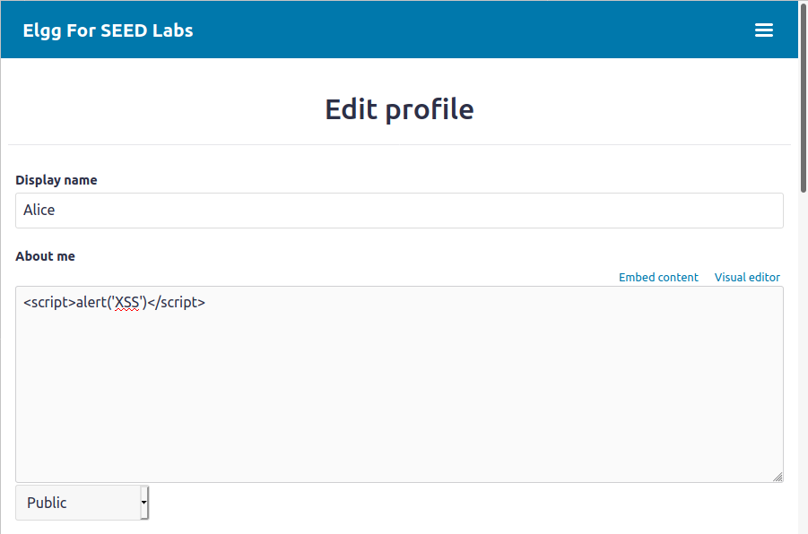
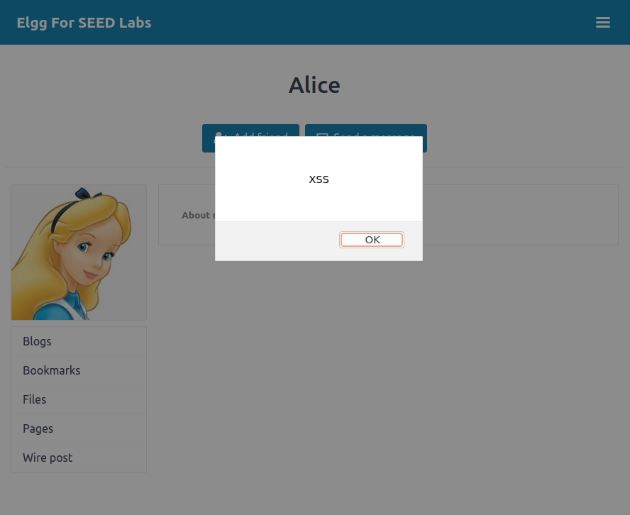
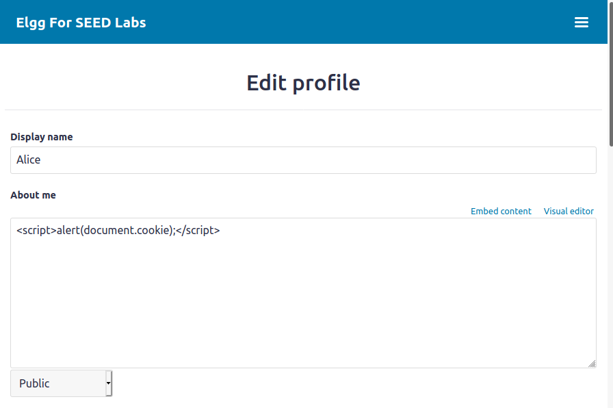
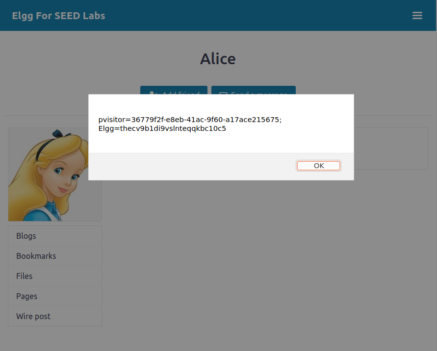
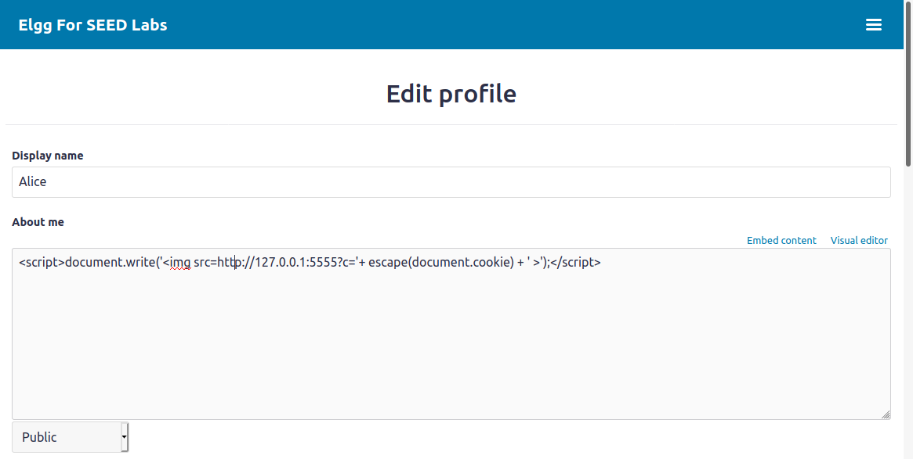
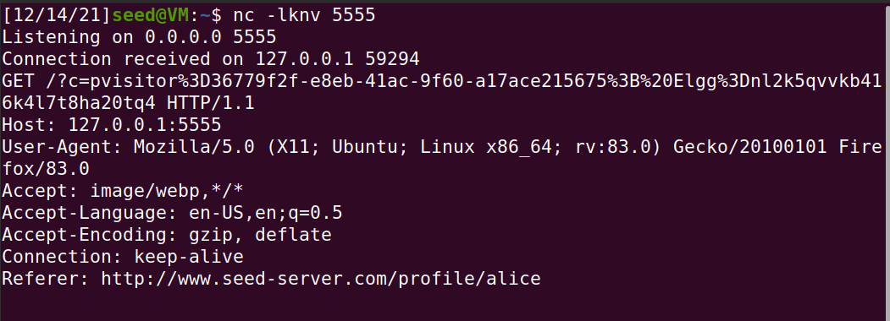
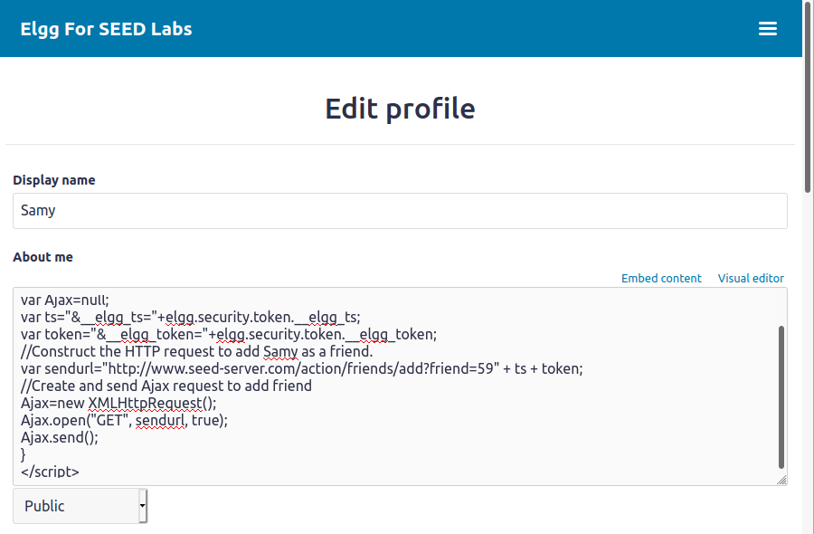
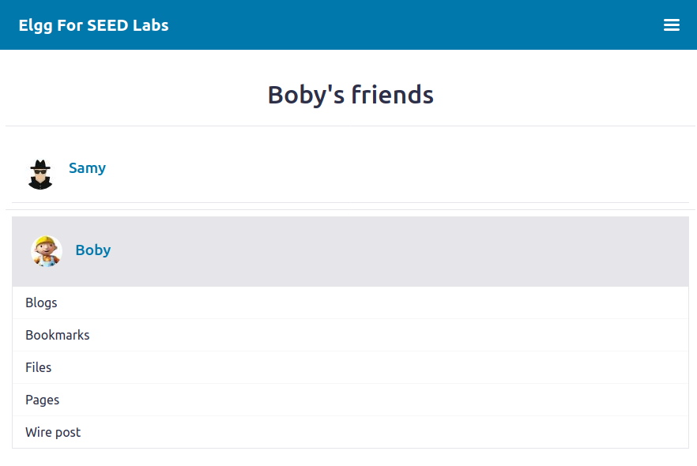

# Task 1

We log in to the website as Alice and edit the about me section of our profile, writing the following javascript. After saving the changes we receive the pop up alert as expected since the page was reloaded and our code executed.

Afterwards we check if the same happens when other users visit our profile (Alice). We login as Boby and visit Alice's profile.

As expected the alert is displayed.

# Task 2

We change the code of the previous attack and check Alice's profile again.

This time the user's cookies are displayed in the alert window.

# Task 3

We change our about me section again with the new code. (We change 10.9.0.1 to 127.0.0.1 in order for the netcat command to work as intended)

When we visit Alice's profile as Boby we receive Boby's cookies. The attack is successful.

# Task 4

We login as Alice and add Samy as a friend. We look at the request and note that the friend value is 59. We login as another user and add Samy, the friend value is 59 again. Therefore 59 must correspond to Samy. The request looks something like this: http://www.seed-server.com/action/friends/add?friend=59&__elgg_ts=somevalue&__elgg_token=somevalue

We construct the sendurl variable based on this information and update the about me section.

We login as Boby and visit Samy's profile. As expected we have become friends with Samy without touching the add friend button.

Answer to question 1: The ts and token variables are needed because without them the request would probably fail. Since its authenticity could not be verified, it could be considered untrustworthy.

Answer to question 2: No, the attack would not work anymore. If we aren't using text mode the special characters we need to use will be encoded, for example the < and > symbols needed for the script tags become &lt and &gt (the input is sanitized). Its no longer js code that will be executed.   

This is what the code of the previous attack looks like if we did not have text mode available: 

~~~~html

&lt;script&gt; 
window.onload = function () { 
var Ajax=null; 
var ts="&amp;__elgg_ts="+elgg.security.token.__elgg_ts; 
var token="&amp;__elgg_token="+elgg.security.token.__elgg_token; 
//Construct the HTTP request to add Samy as a friend. 
var sendurl="http://www.seed-server.com/action/friends/add?friend=59" + ts + token; 
//Create and send Ajax request to add friend 
Ajax=new XMLHttpRequest(); 
Ajax.open("GET", sendurl, true); 
Ajax.send(); 
} 
&lt;/script&gt;

~~~~

# CTF

## Challenge 1

In order to make the administrator accept our justification we we perform an XSS attack. We include this line in our input:
~~~~html
<script>document.getElementById('giveflag').click();
~~~~

Essentially, when the admin views our input, a click on the give flag button will happen because our script is loaded with the page, despite the admin never actually clicking on the button themselves.    

## Challenge 2

There is a buffer overflow vulnerability on line 12, since our input can go unchecked beyond the size of the buffer. Of the mitigation measures
PIE is active. A PIE binary and all of its dependencies are loaded into random locations within virtual memory each time the application is executed. Our goal is to have the program execute our shellcode. We adapted the python script used in the buffer overflow seed lab, saving the buffer address the program prints out in a variable and, with an offset of 108, using it to calculate a return address (108 + int(buffer_addr, 16)). We send it to the server and after the shell is spawned we capture the flag.

