# Task 1

We copy the openssl file and follow the instructions, resulting in having the necessary directories and configuration.

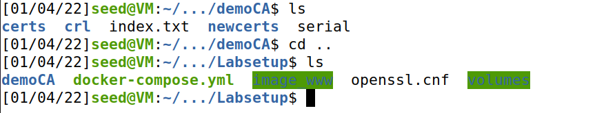

We run the following command: openssl req -x509 -newkey rsa:4096 -sha256 -days 3650 \
-keyout ca.key -out ca.crt

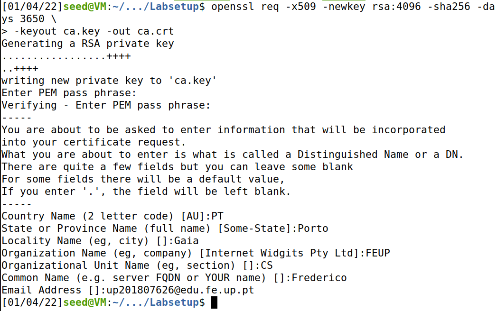

We run these commands:    
openssl x509 -in ca.crt -text -noout    
openssl rsa -in ca.key -text -noout

We know this is a self signed certificate because the issuer and subject are the same:

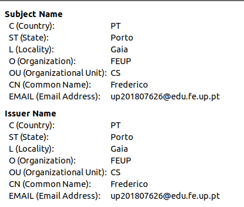

We can also see here that it is in fact a CA:

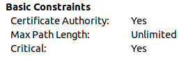

# Task 2
We generate a CSR for www.bank32.com using the command provided and add the alternative names:

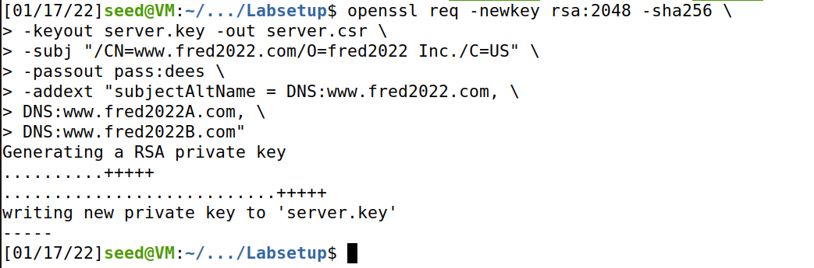

# Task 3
We uncomment the following line in the openssl.cnf:
copy_extensions = copy

We turn the certificate signing request (server.csr) into an X509 certificate (server.crt), using the CA’s ca.crt and ca.key
using the command provided.

The alternative names are in fact included:

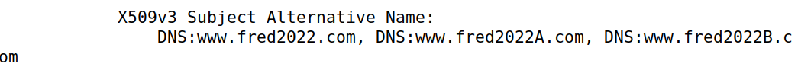

# Task 4

We followed the example provided, adding our own file to the sites-available and sites-enabled. We also copied the server.crt and server.key to the container. Our VirtualHost file looks like this:

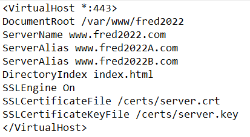

We start the server and try to access the website.
We are met with a security warning saying our connection is not secure, but we click to access anyway, and view our website:

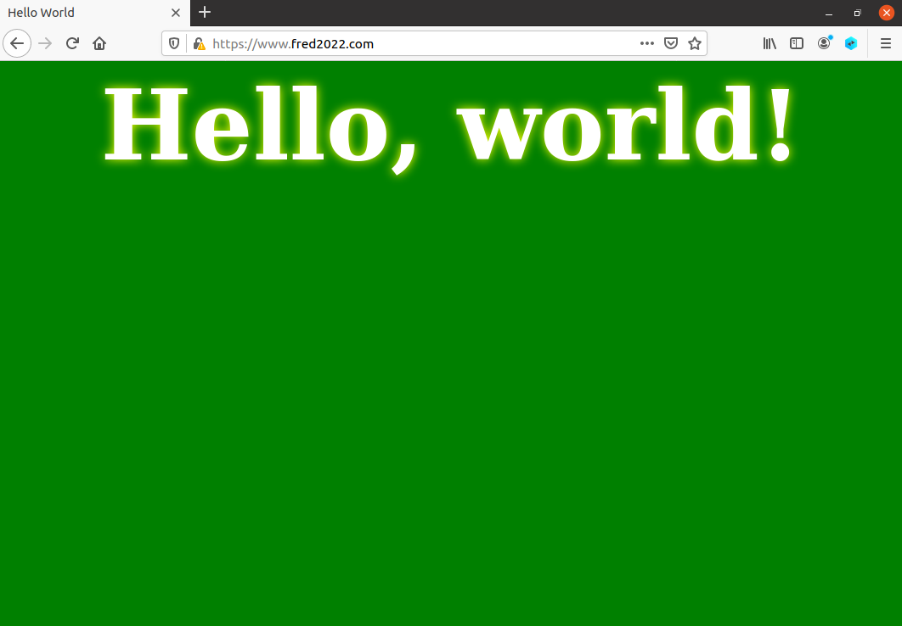

We got a security warning announcing a potencial security threat and the yellow warning icon on the lock next to the url, because our certificate is not on Firefox’s list of accepted certificates. After 
importing to firefox, we select the following
option: “Trust this CA to identify web sites”. 

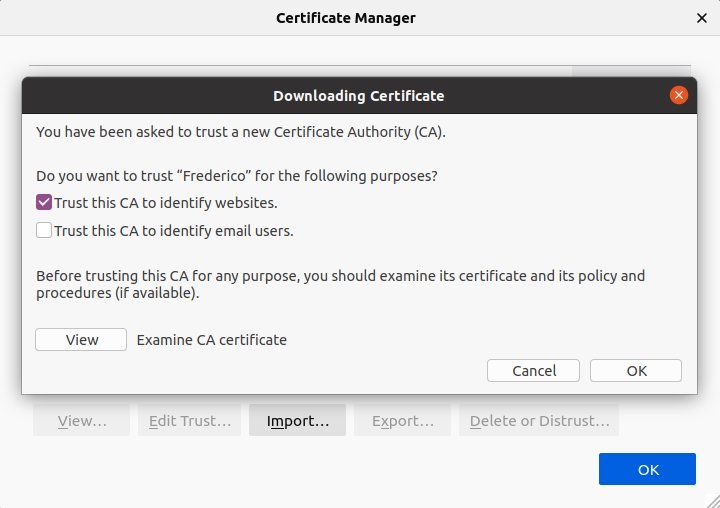

We no longer see the warning and it says our connection is secure.

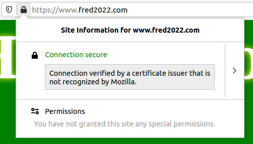

# Task 5

We create the website that is supposed to emulate facebook.com,
and emulate a dns cache poisoning attack, so when we try to access facebook we go to our fake site instead:

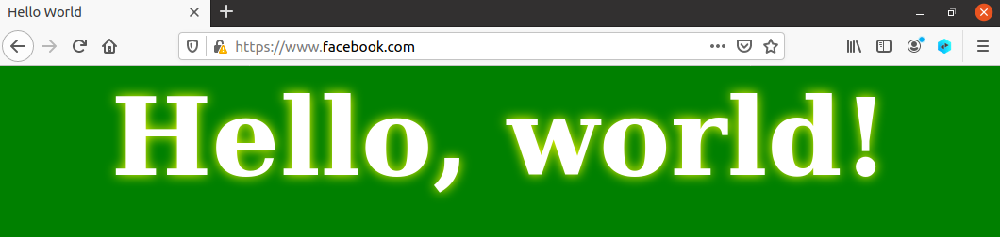

We could easily make it look like actual facebook to have it make sense in a real attack, but for the purpose of this lab it's not an issue. However as we can see in the screenshot the yellow warning icon is present and we did get a full blown warning from firefox that we didnt include in a screenshot before being allowed to access the site.

# Task 6
In this task we assume the CA created in task 1 is compromised by an attacker(the middle man) and they can therefore generate any certificate with the private key.

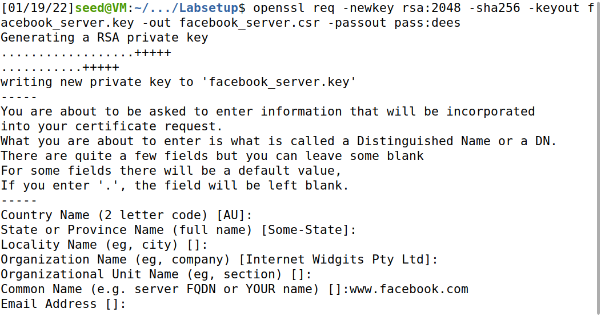

We shall create a new certificate with the CSR and it will be issued by a trusted CA, since the browser trusts our CA already.

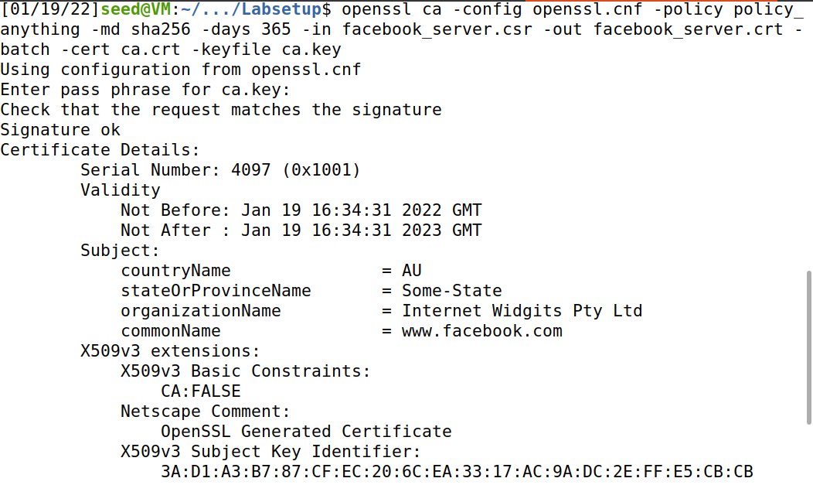

We move facebook_server.key and facebook_server.crt to the container and change our apache_ssl.conf file in the folder sites available in order to read the correct files.

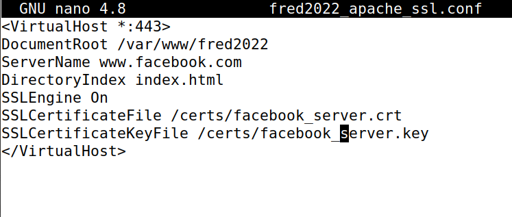

And finally we restart apache and go to facebook.com and are met with our own fake website, without any security warnings at all.

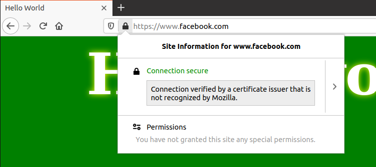