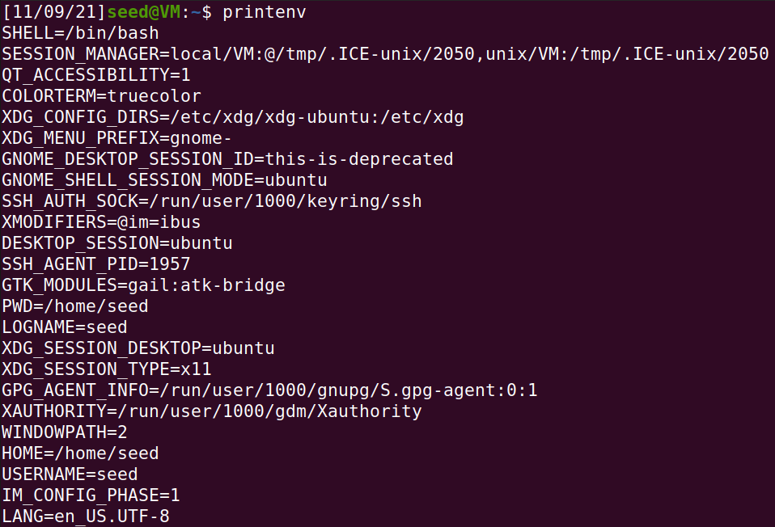
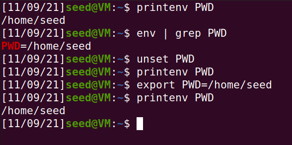
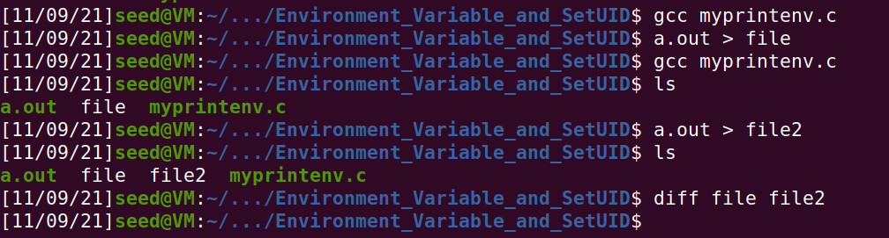
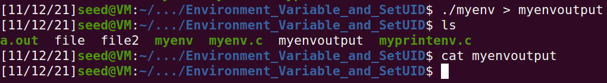
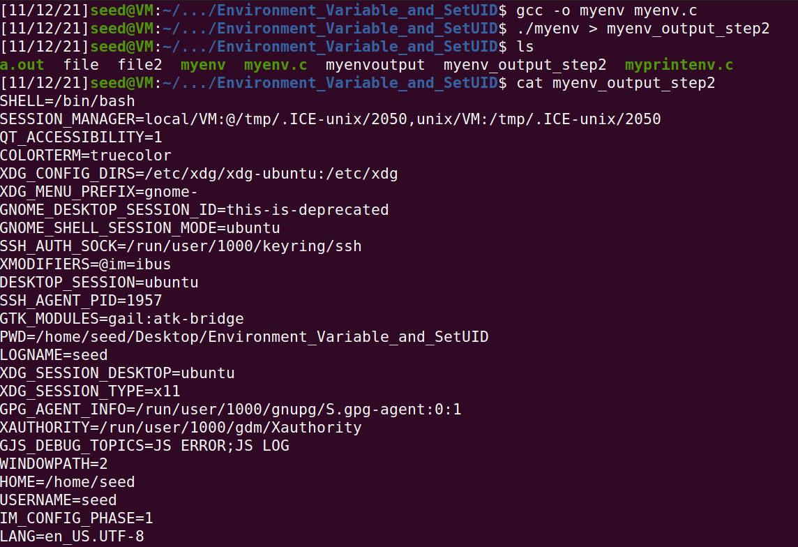
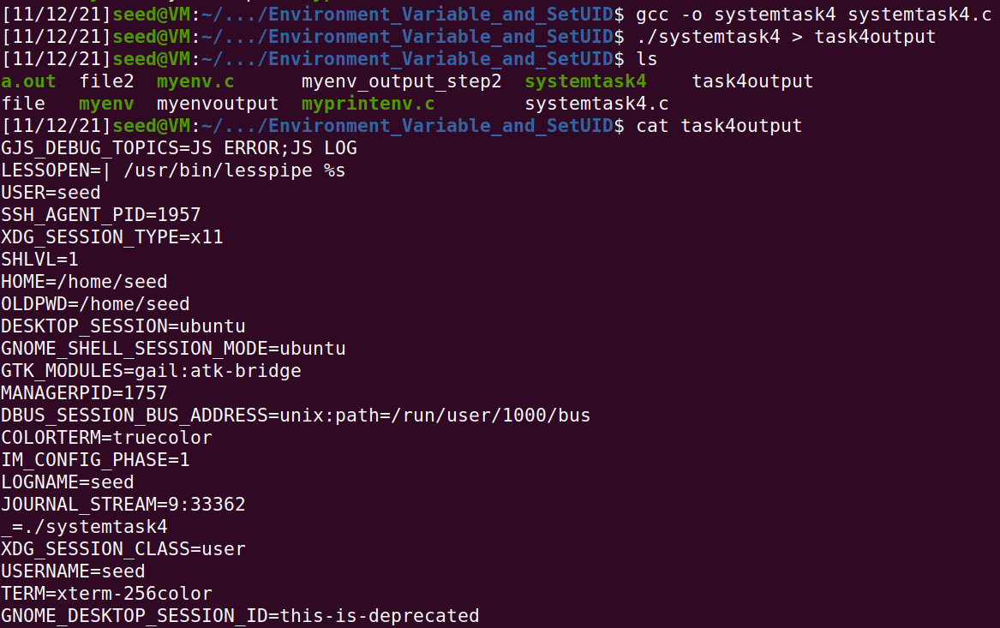
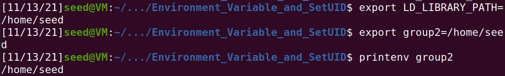
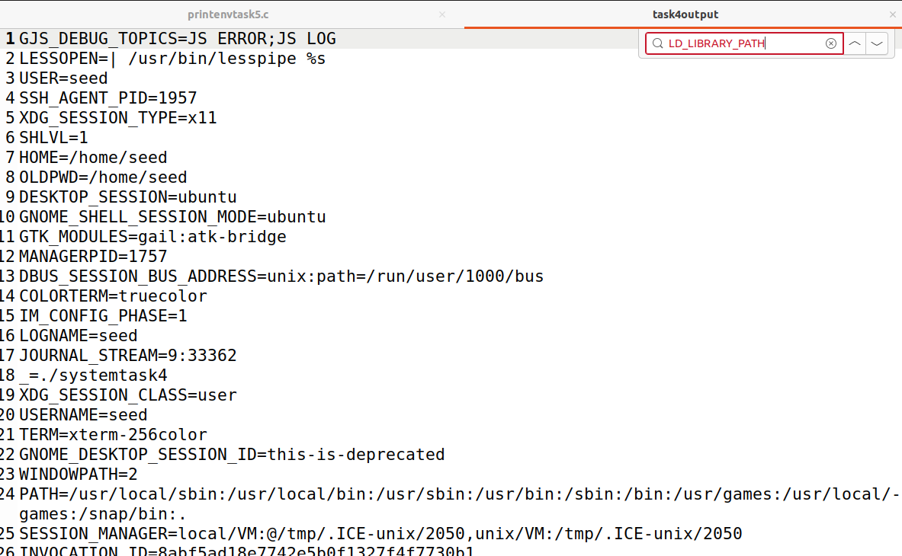
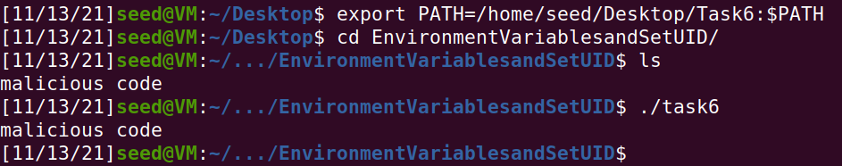

# Task 1

First, we use the printenv command to print out the environment variables. The variables and their respective values are returned.

We also enter printenv PWD which returns the value of the environment variable PWD.
env | grep PWD returns the variables and values that have PWD as a substring.  
Afterwards we unset PWD and try printenv PWD but nothing returns, since we unset the variable. We use export to set the variable again, try printenv PWD, and the value is returned now.

# Task 2

After compiling and running both versions of the program we can conclude that there is no difference in having the child process or the parent process call printenv(), the environment variables and their values are the same.

# Task 3

## Step 1

We compile and run the program, in which the third argument of execve is NULL, and verify that the output file was empty which means no environment variables were associated with this process.

## Step 2

Now we compile and run the same program but the third argument of execve is environ instead of NULL. The output file is no longer empty and contains the expected environment variables and their values.

## Step 3
We can conclude that the process acquires its environment variables through the third argument of execve.

# Task 4

After executing the program, we can observe that when system is called the environment variables are passed, but the order differs when /usr/bin/env is executed directly.

# Task 5

We gave LD_LIBRARY_PATH a value and created a variable of our own, giving it a value as well.
After running the program, we noticed that PATH and the variable we created were inherited, but not the LD_LIBRARY_PATH variable, leading us to conclude not all environment variables may be inherited by the child process.

# Task 6

First we compiled the program that calls system and made it a set-uid program. Then we created our own program that prints out "malicious code". In order to have the first program run our code instead of the intended ls program, we changed the value of the variable PATH to the location of our malicious program.

By changing the variable PATH to the location of our program with the same name as the argument of the system call we were able to run our own code with root priveleges. This was made possible due to the fact that system was using the relative path instead of the absolute.

# CTF

We investigated the website in question and noted that wordpress was being used along with the woocommerce plugin.

We visited exploit-db in search of an exploit for systems using wordpress and the woocommerce plugin and found one that seemed suitable (CVE-2021-34646) https://www.exploit-db.com/exploits/50299. The python script was effective and the authentication was bypassed. As an admin we found the flag in http://ctf-fsi.fe.up.pt:5001/wp-admin/edit.php.