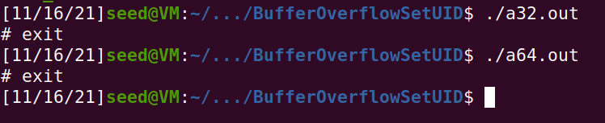
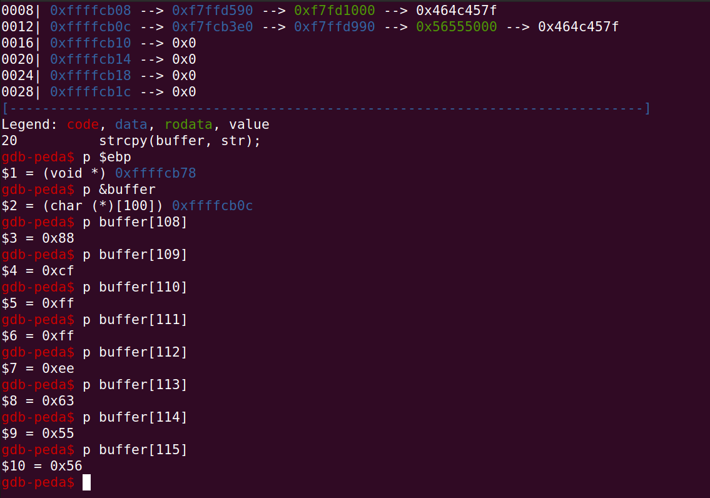
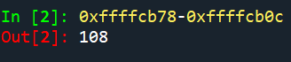
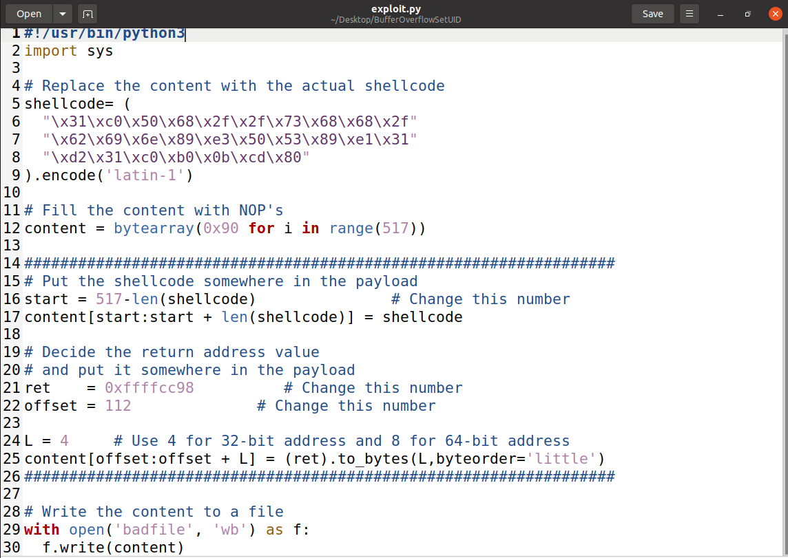
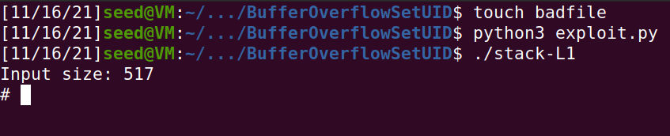

# Task 1

We compile the program following the instructions of the makefile provided. Two binaries were generated, a32.out and a64.out. After running each of them we notice a root shell was spawned.

# Task 2

We compile the vulnerable program using the provided makefile, making sure that  the StackGuard and the non-executable stack protections were turned off using the -fno-stack-protector and "-z execstack" options.
The program was made a root-owned Set-UID program as well.

# Task 3

In order to exploit the buffer-overflow vulnerability in the program, we need to discover the distance between the buffer's starting position and the place where the return-address is stored.  

We set a breakpoint at function bof() and start executing the program. We print the ebp value and get the buffer's address.

We calculate the difference between the ebp and the buffer: 

Therefore the value of the offset should be 108+4=112.  

Because gdb has pushed some environment data into the stack, instead of 0xffffcb78 as the return address value, we go for a larger value: adding 120 did the trick, so 0xffffcc98.
We added the shellcode to the exploit.py file and everything was ready. 

The exploit was successful, and a root shell was spawned.

# CTF
After inspecting the code of the program provided we realized a file was opened, and the name of that file could be changed. That is  because there is a buffer overflow vulnerability, since our input can go unchecked beyond the size of the buffer.  

Using the gdb we tried a few different inputs in order to find the one that could successfully overwrite "mem.txt" with "flag.txt". The input aaaaaaaaaaaaaaaaaaaaflag.txt got us the flag.

The second challenge was not as straightforward as the first, but we managed to change the value val from deadbeef to the proper value (obtained from analysing the source code of the program), as well as overwriting "mem.txt" with "flag.txt", getting the flag. The input was aaaaaaaaaaaaaaaaaaaa\x22\x21\xfc\xfeflag.txt
