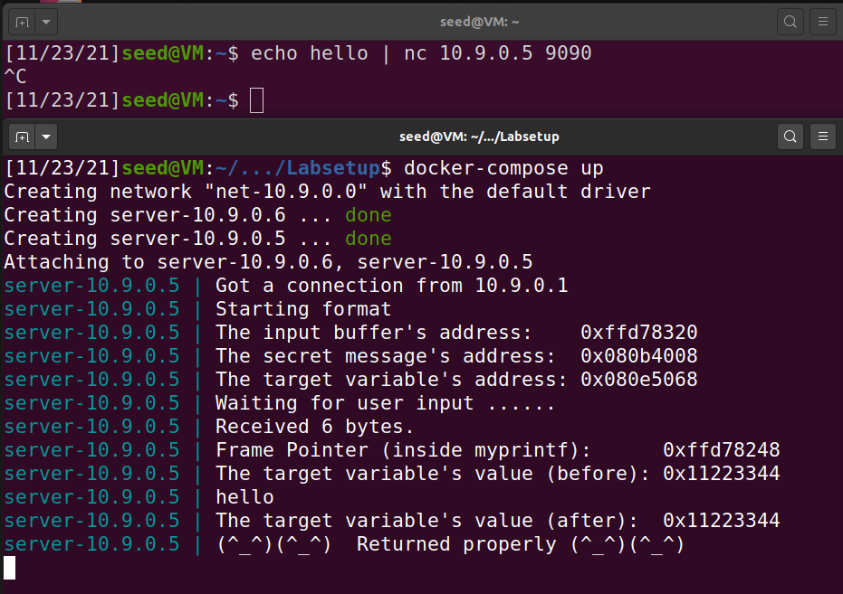
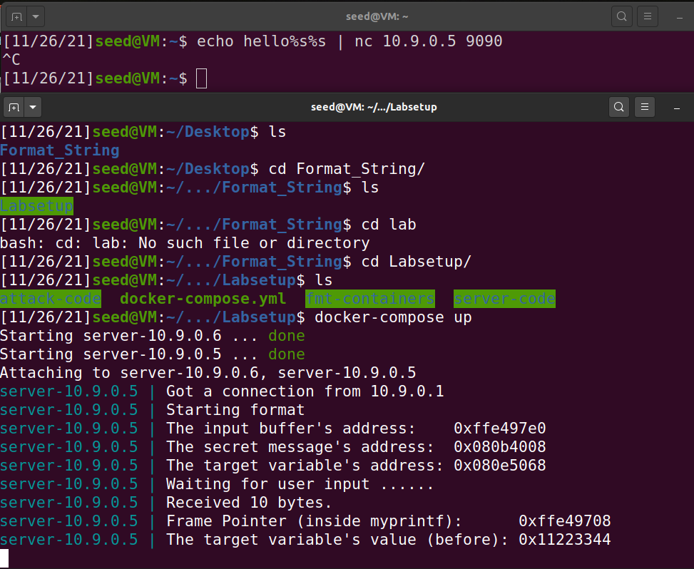
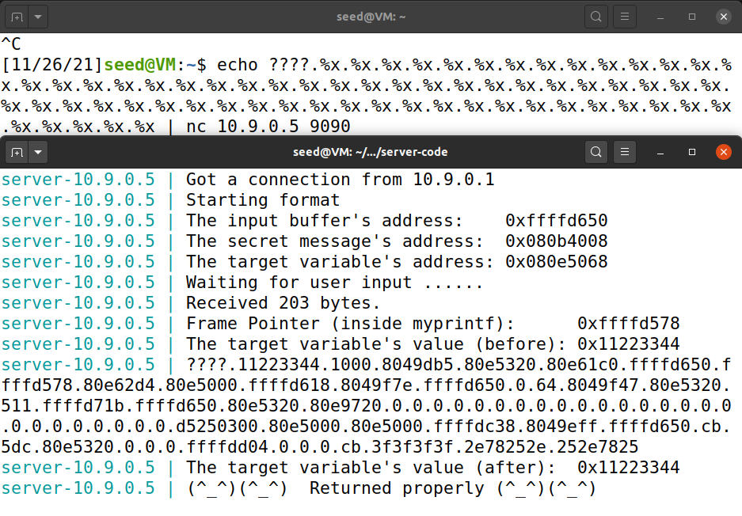
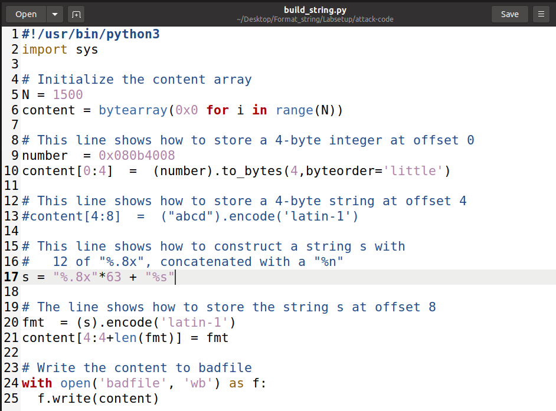
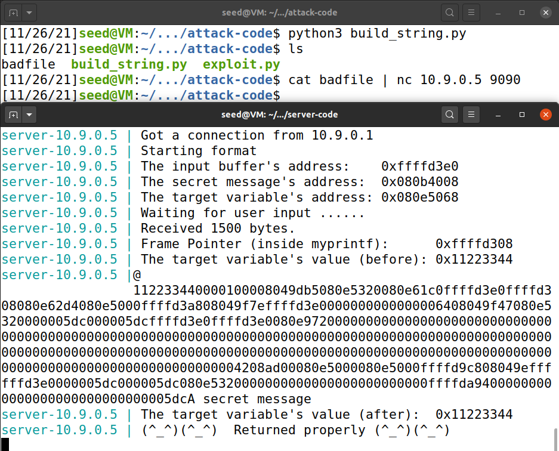
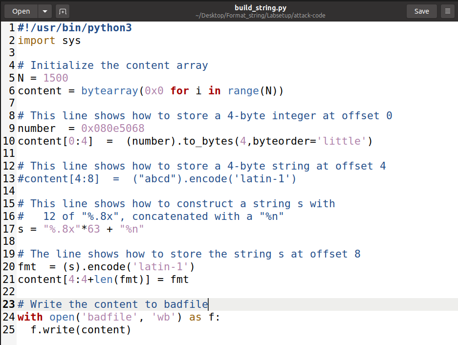
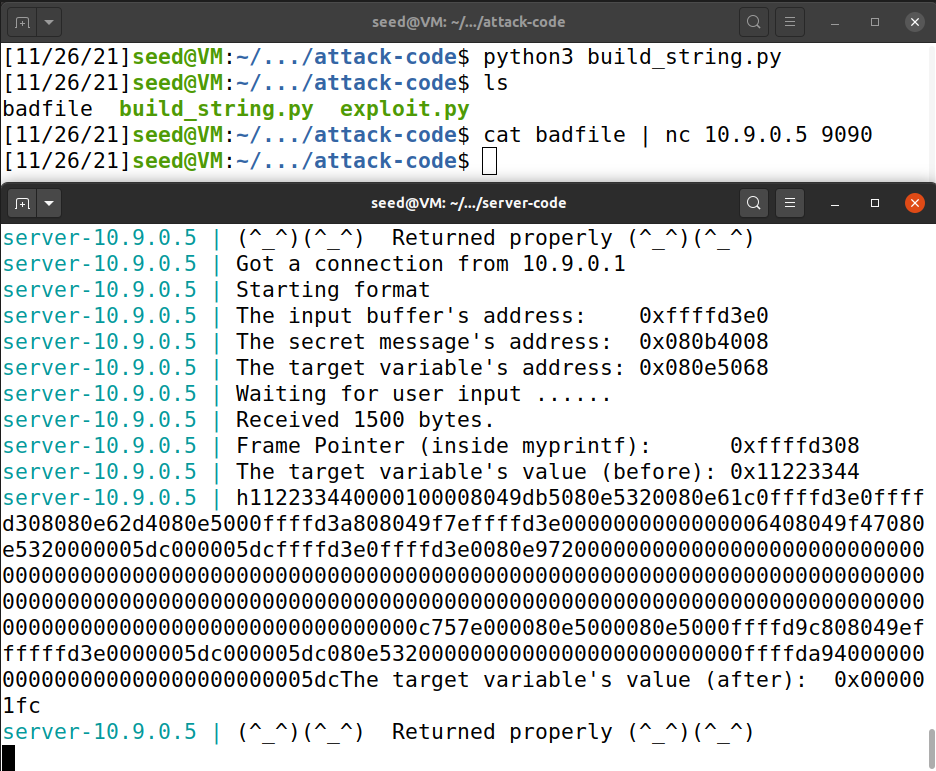
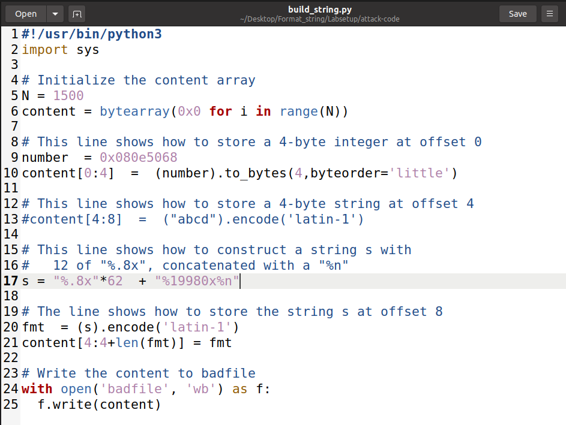
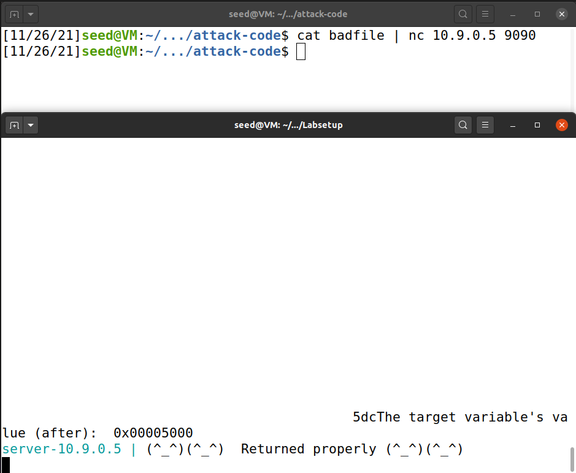

# Task 1
First we send normal input to the server to check its normal response:

To make the server crash, we include in our input the format specifier %s. The program will interpret the %s in the input string as a reference to string pointers, so it will try to interpret every %s as a pointer to a string. At some point, it should reach an invalid address, and attempting to access it causes the program to crash.

# Task 2

## Task 2.A

We chose ???? to be our four byte input, so in the server print out we should see 3f3f3f3f somewhere. 64 %x format specifiers were needed to get the server program to print out the first four bytes of our input.

## Task 2.B

We know the address of the secret message, so now we just need to place the %s format specifier in the right location to read it. It goes in the 64th position, after the address:

# Task 3

## Task 3.A

In order to change the content of the target variable to something else, we use the %n format specifier in the 64th position:

As we can see in the server print out the target variable changed from 0x11223344 to 0x000001fc. The value changed to 0x1fc because we printed out 508 characters (63*8)+4

## Task 3.B

To change the value to 0x5000(20480 in decimal) we need to print out 20480 characters instead of the 508 we did in the last task. To do that we do the math: (62*8 + 4 + x = 20480 <=> x = 19980). Therefore we pad the input with 19980 extra characters and maintain the %n format specifier in the 64th position.

# CTF
## Challenge 1
There is a format-string vulnerability in the line: printf(buffer); This vulnerability will allow us to read data from memory.

First we find the address of the variable with the flag using the gdb: its 0x0804c060.
Then we notice that our input is printed right away on the first %x.
We capture the flag with the input "\x60\xc0\x04\x08%s".

## Challenge 2

In this challenge we have to overwrite the value of the key variable to 0xbeef. To change the value to 0xbeef we need to printout 48879 characters and use the %n format specifier. Knowing the address of the variable key and following the same logic as Task 3.B
the input that got us the flag was: "aaaa\x34\xc0\x04\x08%48871x%n"
